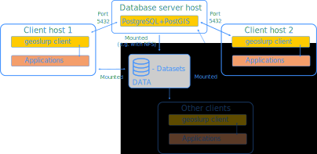

# Download and manage datasets in a PostGreSQL database with the PostGIS
The idea is that this tool contains script to download (i.e. **slurp**) commonly used datasets and to register them in a postgresql+postgis database. This database can then be queried allowing the retrieval of the relevant data or datafiles. 

The main documentation lives at [wobbly.earth/geoslurp](https://wobbly.earth/geoslurp)

## Workings

The geoslurp module itself is a pure python module, which acts as a client. For this to work one needs to [set up a running PostGreSQL database](https://github.com/strawpants/docker-geoslurp).

