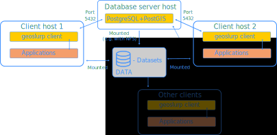

.. _install:

===========================================================================
Installation of the geoslurp package and setting up the PostgreSQL instance 
===========================================================================

Geoslurp will only function when a PostGIS enabled database server is reachable. The python module geoslurp can be considered as a client and does not require the installation of a PostGreSQL database on the client machine itself. In this way, several hosts, with geoslurp installed as clients, can access the same database and data storage location, as indicated in the diagram below.

Installation of the geoslurp package
====================================

Currently the package is not yet in PyPI (but it hopefully will in the near future). Untill then, please clone the git repository and install using setuptools::

   git clone git@github.com:strawpants/geoslurp.git
   cd geoslurp
   pip install .

For a development install you can replace the final line with ``pip install -e .``

Setting up the PostgreSQL database
==================================
To setup the database one is (currently) referred to the documentation of `Running the geoslurp database with (and without) docker <https://github.com/strawpants/docker-geoslurp>`_. The basic steps are essentially to:

1. install a PostGreSQL instance with the PostGIS extension,
2. create a database called *geoslurp*,
3. Add an *admin* scheme (for storing the *settings*, and *inventory* table)
4. set up a *geoslurp* role (read and write), a *geobrowse* role (readonly)
5. Add users with appropriate privileges

